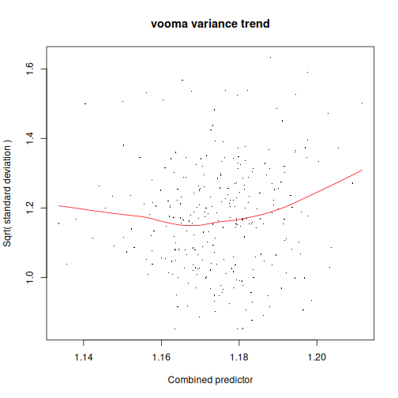
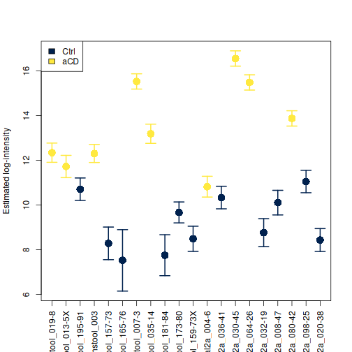
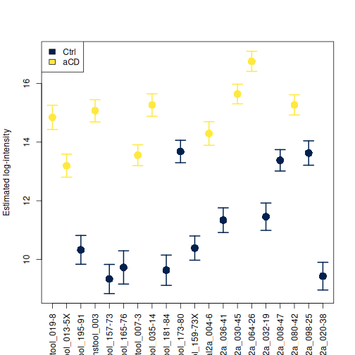
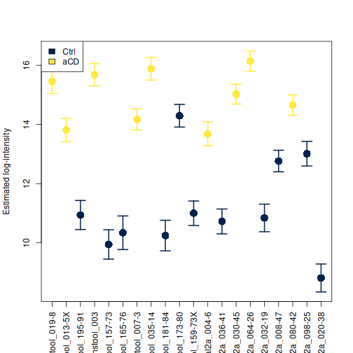
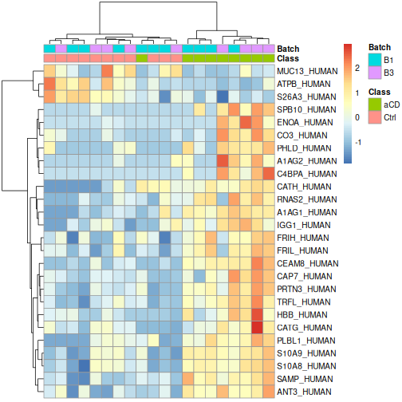
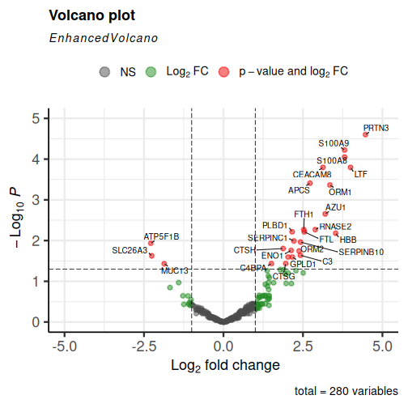

:::::::::::::::::::::::::::::::::::::: questions 

- How can we identify the differentially expressed proteins between our experimental groups?

::::::::::::::::::::::::::::::::::::::::::::::::

::::::::::::::::::::::::::::::::::::: objectives

- Conduct differential expression analysis using `limpa`
- Visualise the top differentially expressed proteins

::::::::::::::::::::::::::::::::::::::::::::::::


## Differential Expression Analysis (DEA)

Now it is time to analyse our data and investigate proteins that are differentially expressed between our two experimental groups (control vs active Crohn’s disease). We will make use of the `limma` package and closely related `limpa` functions specifically designed for proteomics data. 

First, we will **fit a linear model** that includes both Class and Batch effects.


``` r
# Set the control group as our reference
Class <- relevel(Class, ref = "Ctrl")
## We also need to reset our colors to match the correct labels
Class.color <- Class
levels(Class.color) <- hcl.colors(nlevels(Class), palette = "cividis")

# Fit a linear model
design <- model.matrix(~Class + Batch)
design
```

``` output
   (Intercept) ClassaCD BatchB3
1            1        1       0
2            1        1       0
3            1        0       0
4            1        1       0
5            1        0       0
6            1        0       0
7            1        1       0
8            1        1       0
9            1        0       0
10           1        0       0
11           1        0       0
12           1        1       1
13           1        0       1
14           1        1       1
15           1        1       1
16           1        0       1
17           1        0       1
18           1        1       1
19           1        0       1
20           1        0       1
attr(,"assign")
[1] 0 1 2
attr(,"contrasts")
attr(,"contrasts")$Class
[1] "contr.treatment"

attr(,"contrasts")$Batch
[1] "contr.treatment"
```

We can see both Class and Batch accounted for in our design matrix. 

Now we run the `limpa` **differential expression analysis** function `dpcDE()` to identify the top differentially expressed proteins in our dataset.


``` r
fit <- dpcDE(y.protein, design, plot = TRUE)
```



``` r
fit <- eBayes(fit)

# Save our DEA results as a dataframe
results <- topTable(fit, coef = 2, number = Inf)
head(results, n=10)
```

``` output
            Protein.Group   Genes NPrec   PropObs    logFC   AveExpr        t
PRTN3_HUMAN        P24158   PRTN3    11 0.5318182 4.466373 11.146376 6.909178
S10A9_HUMAN        P06702  S100A9    23 0.6086957 3.809771 12.809535 6.354519
S10A8_HUMAN        P05109  S100A8    17 0.6500000 3.811580 12.865666 6.070836
TRFL_HUMAN         P02788     LTF    46 0.3152174 3.998157  9.061431 5.755654
CEAM8_HUMAN        P31997 CEACAM8     6 0.3583333 3.130768 10.078482 5.689096
SAMP_HUMAN         P02743    APCS     8 0.5500000 2.720497 11.028982 5.317255
A1AG1_HUMAN        P02763    ORM1    11 0.4454545 3.349033 10.284907 5.228167
CAP7_HUMAN         P20160    AZU1     6 0.4666667 3.200933 10.422828 4.613155
FRIH_HUMAN         P02794    FTH1    12 0.5625000 2.528228 11.341144 4.227543
RNAS2_HUMAN        P10153  RNASE2     6 0.5666667 2.887340 11.228811 4.222024
                 P.Value    adj.P.Val         B
PRTN3_HUMAN 8.925045e-08 2.499013e-05 7.9144158
S10A9_HUMAN 4.259263e-07 5.962968e-05 6.4365522
S10A8_HUMAN 9.561923e-07 8.924462e-05 5.6692556
TRFL_HUMAN  2.361295e-06 1.601370e-04 4.8072838
CEAM8_HUMAN 2.859589e-06 1.601370e-04 4.6265753
SAMP_HUMAN  8.351613e-06 3.897419e-04 3.6088847
A1AG1_HUMAN 1.079920e-05 4.319680e-04 3.3650146
CAP7_HUMAN  6.335615e-05 2.217465e-03 1.6820862
FRIH_HUMAN  1.897413e-04 5.396191e-03 0.6493740
RNAS2_HUMAN 1.927211e-04 5.396191e-03 0.6366148
```

:::discussion

# A closer look at the results

Our output table is ordered by B statistic. Run `View(results)` to take a closer look at some of the lower ranked proteins.

Are there any proteins with an absolute fold change > 2 (|logFC| > 1) that are not statistically significant? Can you think of some explanations for this?

Hint: Take note of the PropObs value and remember its relationship to standard error.

:::

## Visualise differentially expressed proteins

### Expression values and standard error by sample

We can visualise the log2 expression values for individual proteins, together with standard errors.


``` r
plotProtein(y.protein, "PRTN3_HUMAN", col = as.character(Class.color))
legend('topleft', legend = levels(Class), fill = levels(Class.color))
```



``` r
plotProtein(y.protein, "S10A9_HUMAN", col = as.character(Class.color))
legend('topleft', legend = levels(Class), fill = levels(Class.color))
```



:::::challenge

This simple function plots the protein values from our expression matrix, which we did not directly edit to mitigate batch effects. Try running the `limma` function to remove batch effects from our dataset and see how this changes your plot.

:::solution


``` r
y.protein.rbe <- y.protein
y.protein.rbe$E <- removeBatchEffect(y.protein,batch = y.protein$targets$Batch, group=y.protein$targets$Class)

plotProtein(y.protein.rbe, "S10A9_HUMAN", col = as.character(Class.color))
legend('topleft', legend = levels(Class), fill = levels(Class.color))
```



:::
:::::

### Heatmap

We can filter our results to the up to 50 top most significant differentially expressed proteins, then visualise via a clustered heatmap.


``` r
# Filter for the up to 50 most significant results
sig_proteins_df <- results %>%
  filter(adj.P.Val < 0.05) %>% # filter by p value
  top_n(50, wt = abs(logFC)) # filter by absolute log fold change

sig_proteins <- rownames(sig_proteins_df)
expr_matrix <- y.protein$E[sig_proteins, ]

# Scale the data and visualise via heatmap
scaled_expr <- t(scale(t(expr_matrix)))

pheatmap(scaled_expr,
         cluster_rows = TRUE,
         cluster_cols = TRUE,
         show_rownames = TRUE,
         show_colnames = FALSE,
         annotation_col = y.protein$targets,
         clustering_method = 'ward.D')
```



:::challenge

How would you interpret this heatmap?

:::::

### Volcano plot

We can also visualise our results as a volcano plot using `EnhancedVolcano()`.


``` r
EnhancedVolcano(results,
                lab = results$Genes,
                x = 'logFC',
                y = 'adj.P.Val',
                pCutoff = 0.05,
                FCcutoff = 1.0,
                pointSize = 2.0,
                labSize = 3.5,
                drawConnectors = TRUE,
                maxoverlapsConnectors = Inf,
                lengthConnectors = unit(0.001, 'npc'),
                typeConnectors ='closed',
                ylim = c(0, 5),
                xlim = c(-5, 5))
```




::::::::::::::::::::::::::::::::::::: keypoints 

- We can fit a linear model to our data and conduct differential expression analysis using `limpa` and `limma` functions.
- There are many different ways to visualise differentially expressed proteins.

::::::::::::::::::::::::::::::::::::::::::::::::

